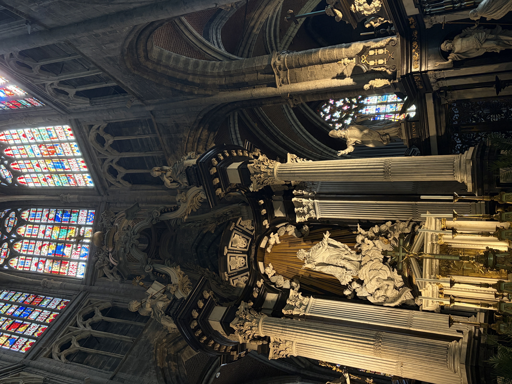
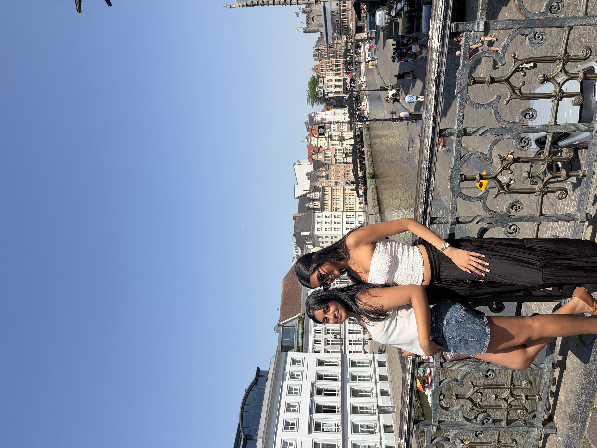
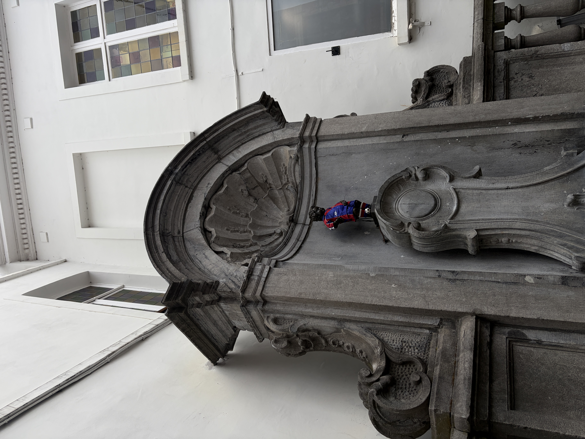

# Phase 2

Phase 2 has taught me so much about computer science and pushed me out of my comfort zone in many ways! After learning about MySQL, ER, and Relational Diagrams, I was able to apply my learning by helping my team draft ways to organize data in effective ways. Specifically, I worked with Manav Mahida on drafting and updating models based on the data sets. For the models, I was the point person for the ER diagrams and helped draft the wireframes for each user persona. I have learned so much already and I am even more excited to apply my learning in the upcoming Phase 3!

Outside of academics, I also thoroughly enjoyed the speakers in Brussels, visit to Atomium, and Ghent! Exploring more about Belgium has also been a highlight and I am looking forward to France soon!

