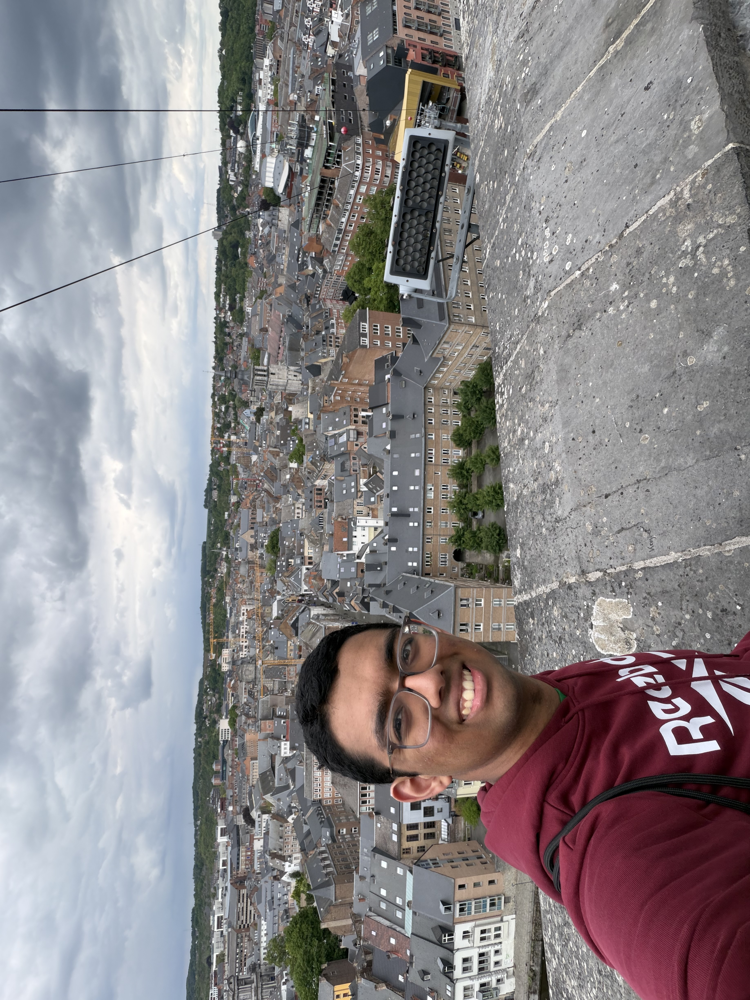

# About Me
Hi! My name is Rishi Ponnapalli, and I'm a rising 2nd year student majoring in Computer Science. I am taking the DS3000 class on this dialogue.

Here's a link to a basic [website](https://rishi.ponnapalli.me) I made about 3 years ago (almost fully developed from my phone).

Here is my [GitHub](https://github.com/greenbear26). Some of my featured projects include applications related to statistics in FIRST Tech Challenge robotics competitions, student course schedule making at Northeastern University, and code for robotics competitions.

In addition to coding and robotics, some of my other interests include playing chess; watching sports like football, baseball, and cricket; and playing the clarinet.

*Me In Namur*