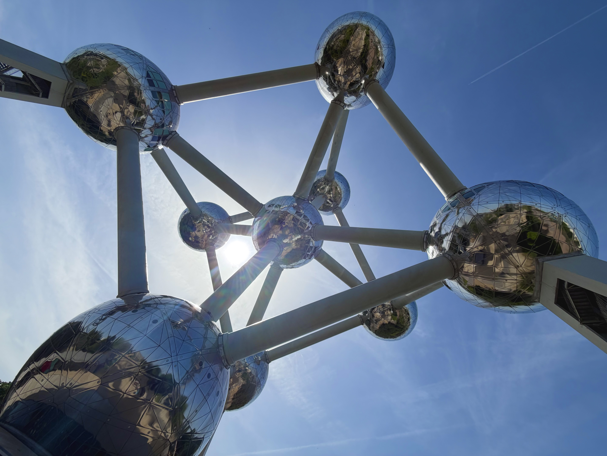
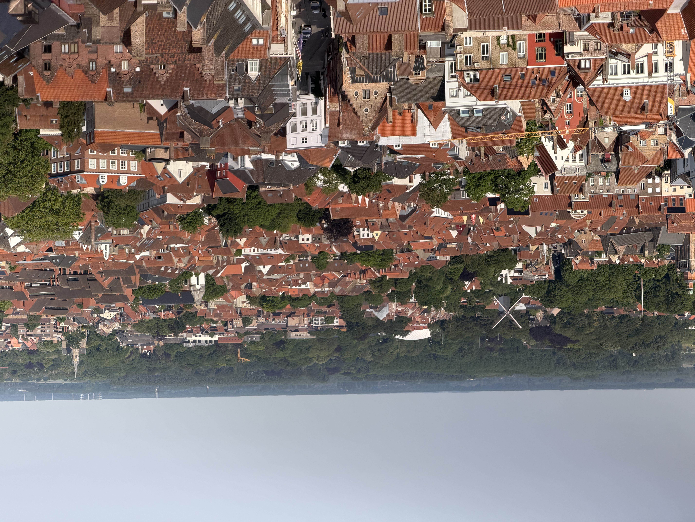
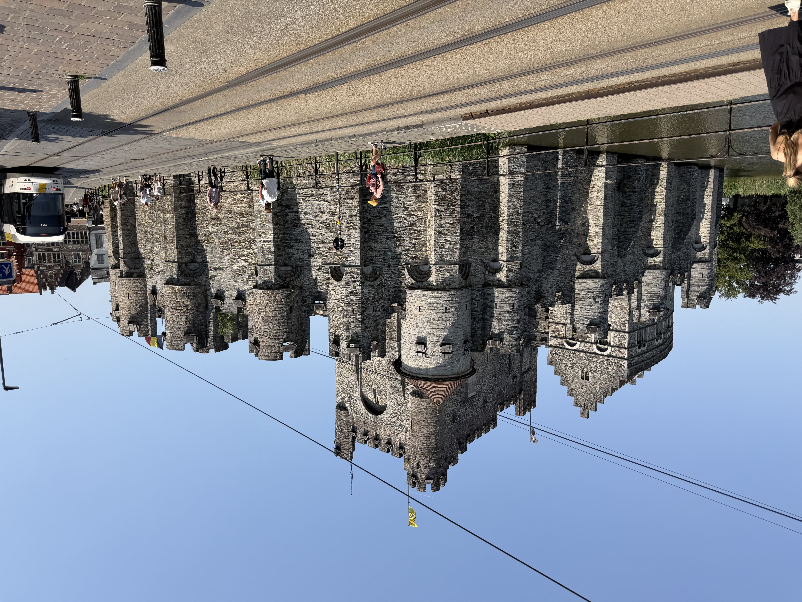

# Personal Blog 2
In this phase, my contributions included sourcing and cleaning some of the data for the ML model. In addition, I looked into more data to improve the model, but was unsuccessful in finding any useful data. For the next phase, I hope to include some more datasets in order to improve the model. Finally, I created some graphs to plot the predicted vs actual y, the residual plots, and a correlation matrix. This helped us to verify the models validity, and while it still wasn't very good, it allowed me to tweak the model to have the best possible parameters.

The trips to different cities in Belgium have been very cool. Here are some images from the cities I've visited:

*The Atomium in Brussels*

*Bruges from the Belfort Tower*

*The Gravensteen Castle in Ghent*
