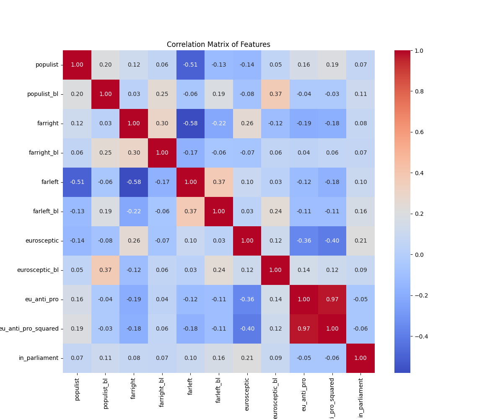
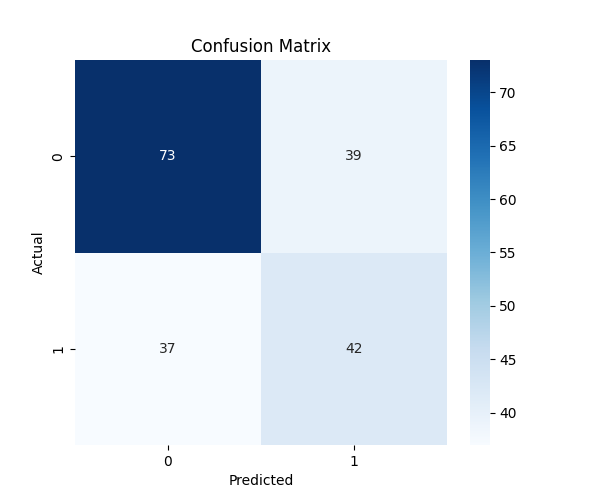

## Blog Post 4

### ML 1 - Predicting EP Meetings

#### UI and Frontend Improvements

After getting feedback in Phase 3, we went back and fixed some issues with how the prediction page was displaying results. The biggest problem was that the output was just showing a raw number like 0.44 with no label, which isn't going to make sense to anyone who looks at it. We fixed this by updating the label to say “ Predicted EP meetings” and displaying it as a clean metric card alongside lobbying cost and EP passes so users can actually understand what they’re looking at. 

We also got rid of the raw JSON block that was showing up under the prediction result. It was just dumping all the input variables as unformatted JSON on the screen which didn't look good and wasn't useful for the user. We replaced it with a simple caption that summarized the inputs in English.

One thing worth noting is that the country dropdown on the prediction page does 
not currently affect the model output. This is because country is not one of our 
feature columns — the model uses lobbying cost, EP passes, members FTE, and 
interest type as inputs. We kept the country field in the UI since it provides 
useful context, but it is a known limitation of the current model that geographic 
variation is not captured in the prediction.

#### Interactive Scatter Plot

One of the bigger additions to this phase was an interactive scatter plot on the prediction page. After a user runs a prediction, they can now see a chart that plots all lobbying organizations by lobbying cost vs EP meetings on a log scale, with their predicted organization shown as a red star. This lets users actually see where they land compared to everyone else in the dataset, which is a lot more meaningful than just seeing a number. We also added a “Similar Organizations” section below the chart that shows up to 5 organizations with a similar lobbying cost range, each with a Save button so users can send them straight to the Organization Comparison page.  

### ML 2 - Party Parliamentary Presence

#### Connecting to the Lobbying Theme

One of the main piece of feedback we got for ML 2 was that it felt disconnected from the lobbying side of the project. We were predicting whether a political party is in parliament based on ideology scores, but there was no obvious link to lobbying organizations. In phase 4 we tried to fix this by bringing in the Integrity WatchMEP meetings dataset. This dataset has over 65,000 published lobbying meetings between MEPs and lobbying organizations, tagged by EP political group. We then mapped the national parties in our Populist and ParlFacts datasets to their corresponding EP groups using a party family mapping. This lets us connect the idelogy features we use for the model to real lobbying activity thats actually happening in the European Parliament.

We also built a new page for the journalist persona called “Which Lobbyists Are Influencing EU Party Groups?” where users can pick an EP party group and see which lobbying organizations have met with them the most based on the Integrity Watch data. This pairs with the Part Parliament Prediction page to give journalists a more complete picture. They can now predict how likely a party is to hold seats, and then see which lobbyists are actively targeting the same party group.   

#### ML 2 

ML 2 is still logistic regression using SGDClassifier, predicting in_parliament as the target. We use ideology features from Populist and Parlfacts including populist scores, far-right, far-left, eurosceptic flags, left-right positioning, and EU stance. We trained the model using LOO-CV, and the F1 score was 0.6. Here are some images that demonstrate the validity of the model:

This is our correlation matrix for the model, which shows that none of our pfeatures were too strongly correlated.

---

This is our confusion matrix. It shows a pretty even split of failures across false positives and false negatives, which further helps to show our model is valid.

## Presentation

### The Pitch
44% of European citizens say they don't understand how the EU works. Meanwhile, thousands of organizations are spending hundreds of millions of euros every year trying to influence its policies. That information is technically publicly available. But it's scattered across databases, buried in jargon, and hard to access for the average person to find.
That's why we built LobbyLens. LobbyLens is a web application that allows you to filter and track lobbying activity by policy area and country. It also allows you to see exactly what organizations are spending, predict how many EU Parliament meetings an organization is likely to get, and track how political parties across the EU shape their national governments.
Information is power, and LobbyLens puts it back in the hands of the people. So join LobbyLens today.

### The Stack
LobbyLens is built on three layers running inside Docker. The frontend is a multi-page Streamlit app (web-app) that collects user input and renders data through persona-specific pages. It communicates exclusively through HTTP requests to the Flask REST API (web-api), which handles all business logic, ML predictions, and database queries. The database layer is MySQL (mysql_db), seeded from our lobbyfacts and World Bank CSV datasets. The three containers communicate over a shared Docker network. Streamlit calls Flask at http://web-api:4000, and Flask connects to MySQL using environment variables for credentials.
### The DB
The schema started in Phase II as a rough outline and evolved significantly through Phase III. Early versions had foreign key errors and a hardcoded org_id that broke POST routes; we fixed this by switching to AUTO_INCREMENT and expanding country_code to VARCHAR(100) to handle full country names from our dataset. The final schema centers on lobbying_organization as the core entity, with lookup tables for country_indicator, industry, and app_user, and four standalone ML parameter tables storing trained beta values and scalers for both the lobby influence and party prediction models. The party_info and party_to_lobby_info tables support the political party side of the app, linking Parlfacts party data to lobbying organizations.
### Deployment
The entire app runs in Docker Compose with three containers — web-app, web-api, and mysql_db. Cloning the repo, creating a .env file with database credentials, and running docker compose up --build spins everything up. The database initializes from 01-ddl.sql and 02-inserts.sql automatically on first build. A one-time data load command populates the lobbying_organization table from the CSV. No manual code edits or specialized knowledge of the data model are needed to get the app running.
### Frontend
We designed a frontend layer for three distinct user personas: a European Citizen, an Investigative Journalist, and a Political Science Researcher. Each persona has their own dedicated home page and set of pages tailored to their use case.
The European Citizen persona (Stromae) is built around discoverability; their home page features an interactive card picker where they can select policy areas and countries they care about, which submits their preferences to the API and surfaces relevant lobbying organizations influencing those policies. The Political Science Researcher persona (Jacques Clouseau) is built around comparison and analysis; they get a full Organization Comparison page where they can search for organizations, save them, and compare two side by side with lobbying spend, policy areas, and ML influence scores. The Investigative Journalist persona is focused on NGO deep-dives, with filtering and profile pages for exploring specific organizations and their activity history.
Across all personas, the frontend supports searching and filtering by organization name, policy area, and country, saving organizations to a session-based list, and running ML predictions directly from the UI. Each persona page communicates exclusively with the Flask REST API. There is no direct database access from the frontend.
Building these pages meant constantly cross-referencing our API routes to make sure every user input had a corresponding endpoint. For example, the country and policy area filter dropdowns on the Organization Comparison page pass policy_area and country as query parameters to GET /organizations, and the ML score displayed on each org card hits GET /organizations/{org_id}/influence-prediction. Any time we added a new UI feature, we had to verify the route existed and returned the right shape of data.
We also had to update our SQL DDL as the project evolved. A key addition was the party_to_lobby_info table, which links political party data from our Parlfacts dataset to lobbying organizations; this connection powers the political party side of the app and allows users to see which parties are associated with which lobbying groups. Here is the table:
CREATE TABLE IF NOT EXISTS party_to_lobby_info (
    ep_party              VARCHAR(12) NOT NULL PRIMARY KEY,
    lobbyists             TEXT NOT NULL,
    meetings_per_lobbyist VARCHAR(255) NOT NULL,
    total_meetings        INTEGER NOT NULL
);

